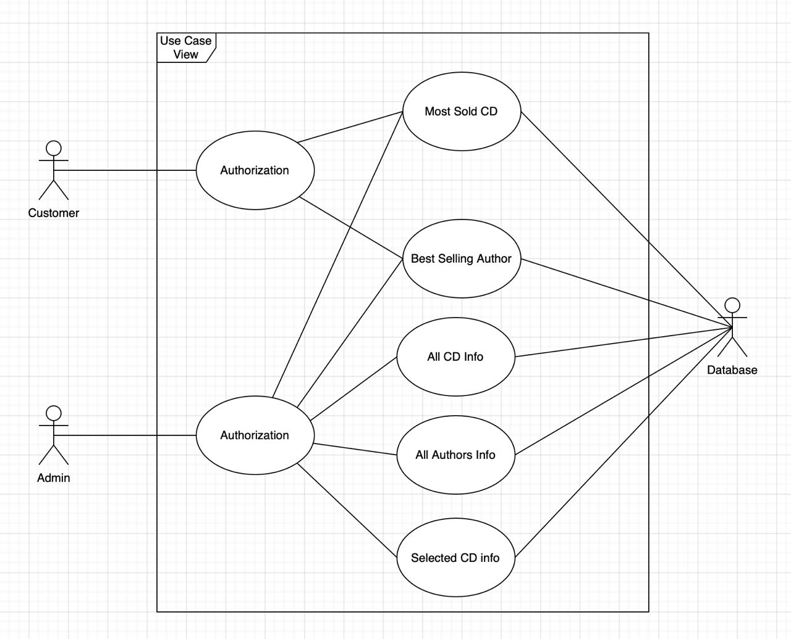
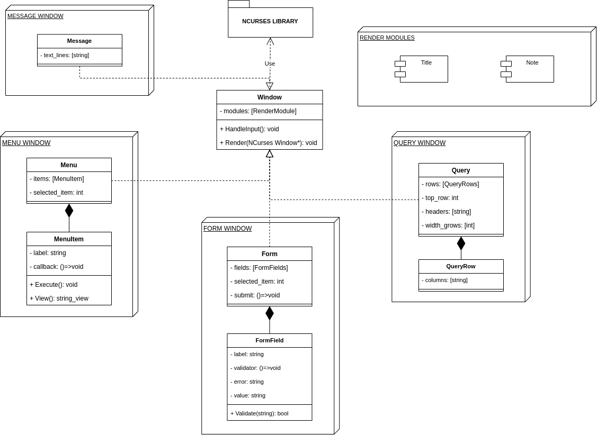

# UML Diagrams

## Use-cases

This Use-case diagram depicts the relationship between actors such as admins and average customers(users) and use cases based on the task specification.

## Classes

This class diagram covers the core behind program dynamic UI
based on the usage of ncurses rendering features. It also features `Render Modules`
as component-based architecture to enrich functionality of windows and provide
better UX

